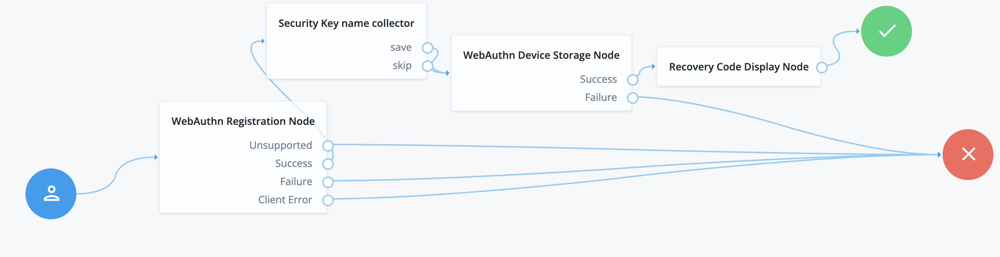

# WebAuthn Device Name Collector

## Introduction

JS scripted node that (optionally) collects roaming authentication security key name and saves it in the profile. If skipped, the script does nothing and the default security key name "New Security key"

## Contents

Example AM tree

After a successful device registation, a prompt will pop-up:

If the user provides a name, that's saved in transientState and then it's picked up by the WebAuthnStorageNode. 
If the user skips it, then the default device metadata will be used and picked by the WebAuthnStorageNode.

## Configuration

Create an AM scripted decision nodes using the scripts in the [src](src) directory.

Specific configurations:
- In the WebAuthnRegistration node, you must enable "Store device data in transient state"
- In the Scripted Decision node config, you need to add webauthnDeviceData as script input.
